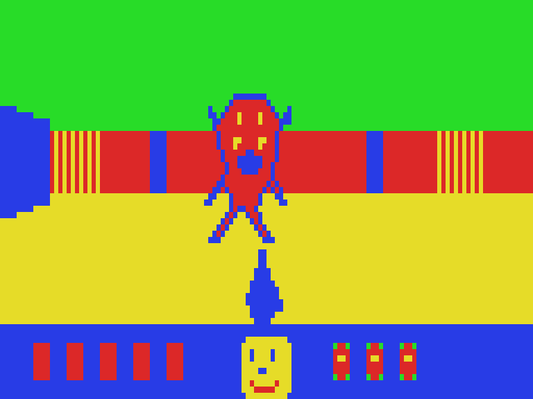
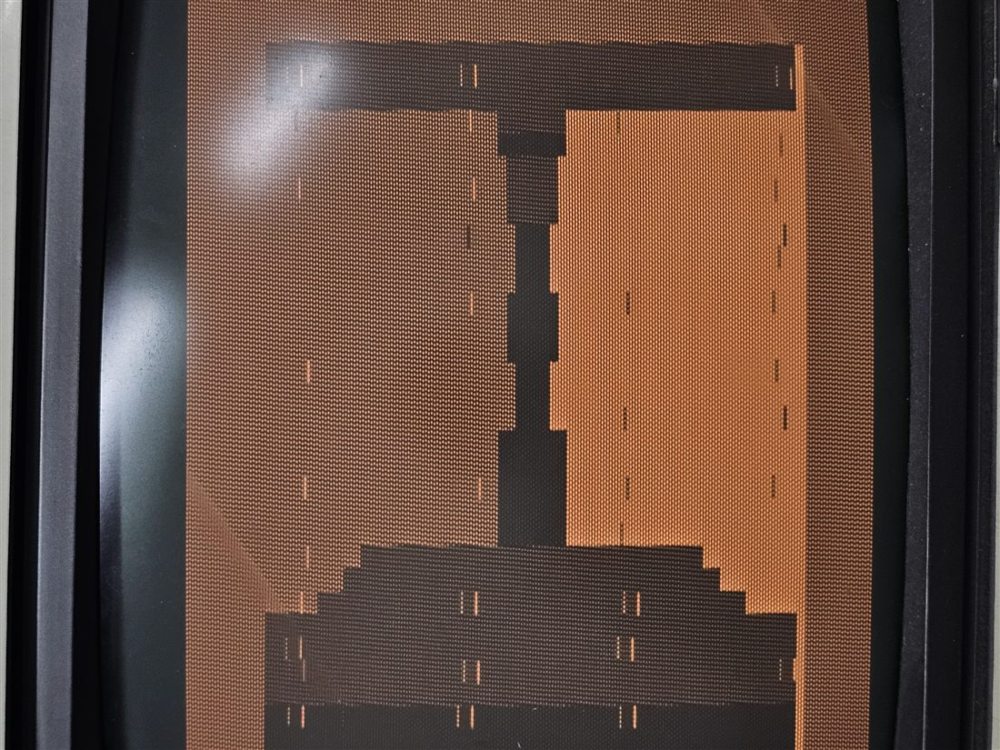

# VZ-DOOM

A Wolfenstein-style, first-person 3D maze shooter for the **1983 VTech / Dick Smith
VZ200** — a Z80 home computer running at 3.58 MHz with 2 KB of video RAM and four
colours. Real-time raycasting, doors, chasing demons, sound, and a DOOM-style
status face, all in hand-written Z80 assembly on the original hardware.



*Rendered by the game's own engine — a demon dead ahead, pistol drawn, health bar
and Doomguy's face at the bottom.*

Yes, it really runs on a stock VZ200:



---

## What it does

- **Raycast 3D** — 32 columns cast through a 16×16 grid map with integer DDA,
  perspective wall slices, fisheye correction, two-tone wall faces.
- **128×64, 4-colour** MC6847 graphics mode (Mode 1), ~15–30 fps depending on
  how much of the maze is visible.
- **Move & fight** — walk, turn, strafe, open doors (they auto-close behind you),
  and shoot. Three demons hunt you through the maze; they slide along walls and
  come through open doors.
- **Status HUD** — health pips, kill tally, and a five-state DOOM-style face that
  gets bloodier as you take damage, flashes when bitten, and X-eyes when you die.
  At full health his eyes glance left and right, just like the original.
- **Sound** — footsteps, door whoosh/thunk, pistol zap, pain grunt, death wail,
  all on the VZ's 1-bit speaker.

All of it is plain Z80 machine code executing on the actual CPU — no emulator,
no coprocessor doing the heavy lifting.

## Play it

**The quick way:** copy [`dist/VZDOOM.VZ`](dist/VZDOOM.VZ) to an SD card for a
[BennVenn SD Loader](https://bennvenn.myshopify.com/products/vz300-sd-loader),
then on the VZ200:

```
LOAD "VZDOOM"
```

It autostarts.

### Controls

| Key      | Action              |
| -------- | ------------------- |
| `W` / `S`| forward / back      |
| `A` / `D`| turn left / right   |
| `,` / `.`| strafe left / right |
| `E`      | open door           |
| `SPACE`  | fire                |
| `Q`      | quit to BASIC       |

### Requirements

- A VZ200 (or VZ300 / Laser 200/210/310) with **at least ~28 KB of RAM** —
  the BennVenn SD Loader provides this. The game's code lives in base RAM and its
  data tables load into expansion RAM at `$9000`.
- Any way to get a `.VZ` file onto the machine (the SD Loader is the easy path).

If you don't have the RAM expansion, the game won't fit — see
[DESIGN.md](DESIGN.md) for the memory map.

## Build it yourself

You need [**sjasmplus**](https://github.com/z00m128/sjasmplus) (a Z80 cross
assembler) and, optionally, Python 3.10+ (only to regenerate the lookup tables).

1. Download sjasmplus and put `sjasmplus.exe` in the [`tools/`](tools/) folder.
2. (Optional) regenerate tables — needed only if you change the map, art, or
   engine constants:
   ```
   python tools/gen_tables.py
   ```
3. Assemble and wrap into a `.VZ`:
   ```powershell
   .\build.ps1 src\vzdoom.asm VZDOOM
   ```
   The playable file lands in `build/VZDOOM.VZ`.

The committed [`src/tables.inc`](src/tables.inc) is pre-generated, so you can
build the game with sjasmplus alone — Python is only for changing the data.

## How it was built (the interesting part)

Every binary in this project ran correctly on the first hardware attempt, because
nothing reached the VZ200 without passing a **byte-exact simulator check** first:

- [`tools/gen_tables.py`](tools/gen_tables.py) is a Python *reference
  implementation* of the entire renderer, using exactly the same integer math
  (8.8 fixed point, 8-bit angles) the Z80 performs. It also generates the trig,
  fisheye, wall-height, sprite, and HUD tables.
- [`tools/z80sim.py`](tools/z80sim.py) is a small Z80 interpreter that executes
  the **real assembled binary**.
- [`tools/doom_test.py`](tools/doom_test.py) drives the binary in the simulator
  with scripted keyboard input and compares the emulated video RAM against the
  Python reference, **byte for byte**, across ~17 scenarios (movement, wall
  collision, doors, demon AI, hitscan kills, damage, death, and an 88-position
  projection sweep).

This caught bugs that would have been maddening to debug on a CRT — including a
Z80 division routine that dropped a carry bit and made demons flicker and
teleport. See [DESIGN.md](DESIGN.md) for the full milestone-by-milestone story.

## Repository layout

```
src/
  vzdoom.asm      the game (current build)
  wavedemo.asm    milestone 1 — column renderer
  raycast.asm     milestone 2 — the raycaster
  walk.asm        milestone 3 — movement
  tables.inc      generated data tables (map, trig, sprites, HUD)
tools/
  gen_tables.py   Python reference renderer + table generator
  z80sim.py       minimal Z80 interpreter (the verifier)
  doom_test.py    byte-exact test suite
build.ps1         assemble + wrap a .VZ file
dist/VZDOOM.VZ    prebuilt, ready to play
DESIGN.md         design notes and development history
```

## Credits & thanks

- Built for the VZ200 using **BennVenn's SD Loader** and his CPLD bus-export
  firmware — the SD Loader is what makes loading (and the RAM expansion) painless.
  <https://bennvenn.myshopify.com/products/vz300-sd-loader>
- Assembled with [sjasmplus](https://github.com/z00m128/sjasmplus).
- The VZ/Laser community: <https://www.facebook.com/groups/4609469943>

DOOM is a trademark of id Software. This is an affectionate homebrew tribute, not
affiliated with or endorsed by id/ZeniMax/Microsoft. It shares the genre and the
grinning-face HUD idea, none of its code or assets.

## License

[MIT](LICENSE) — do what you like, have fun, and if you get it running on your own
VZ, post a video for the group. 🕹️
